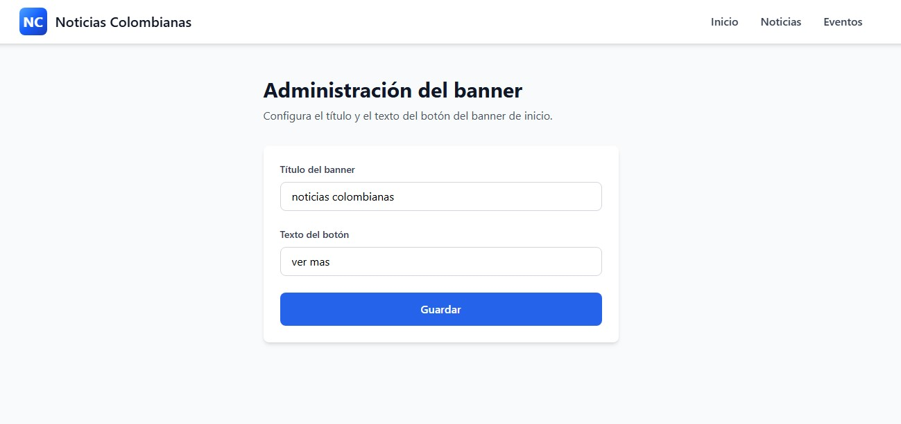

# Portal de Noticias - Prueba Técnica

## Explicación de la solución

Portal web enfocado en noticias y eventos de Medellín, Colombia. Cuenta con tres secciones principales: **Inicio**, **Noticias** y **Eventos**, con contenido dinámico y una vista de administración (/admin) para gestionar textos clave.

---

## Tecnologías

| Herramienta | Uso |
|---|---|
| Figma | Diseño del mockup |
| React + Vite | Implementación del frontend |
| TypeScript | Tipado estático |
| Tailwind CSS  | Estilos y diseño responsive |
| JSONPlaceholder API | Fuente de noticias dinámicas |
| localStorage | Persistencia de contenido |

---

## Mockup

Diseño previo a la implementación, creado en Figma como referencia visual.

[Ver mockup en Figma](https://smooth-vision-71495425.figma.site)

---

## Cómo ejecutar el proyecto

```bash
git clone <url-del-repositorio>
cd noticiasColombianas
npm install
npm run dev
```

---

## Decisiones técnicas

El proceso empezó con el mockup en Figma, tomando como referencia otros portales informativos de actulidad.

La idea inicial era integrarlo con WordPress - primero como plugin o como tema personalizado - dado que el rol involucra gestión de contenido y CMS. Ambas opciones resultaron ser de pago en los planes disponibles, por lo que se descartó WordPress y se optó por React.

Para resolver el punto de edición de contenido (simulación CMS), se creó una **página de administración** dentro de la misma app, donde se pueden modificar el texto del banner principal y el texto del boton principal. Los cambios se persisten en `localStorage` y se reflejan en el frontend al recargar.

---

### Vista `/admin`



Permite editar dos campos clave del banner principal:
- **Título del banner**
- **Texto del botón**

## ¿Qué mejoraría con más tiempo?

- Crear una API propia para noticias reales de Medellín/Colombia, en lugar de usar datos de placeholder
- Agregar autenticación a la vista de administración

---

## Supuestos

Considerando la descripción del rol y mi experiencia previa con CMS, el enfoque inicial apuntó a WordPress. Al no ser viable, se priorizó demostrar las mismas competencias como optimización, edición de contenido, persistencia de datos y consumo de API dentro del entorno React.

---

## Estimación vs tiempo real

| Fase | Estimado | Real |
|---|---|---|
| Maquetación + UX en Figma | 2 horas | 1 hora |
| Maquetación + UX en React | 1 hora | 3.5 horas - incluye exploración con WordPress (plugin y tema), arranque del proyecto en React y ajustes de responsive |
| Consumo de API | 1 hora | 1 hora |
| Simulación CMS | 30 min | 30 min |
| Documentación | 30 min | 30 min |
| **Total** | **5 horas** | **6.5 horas** |
